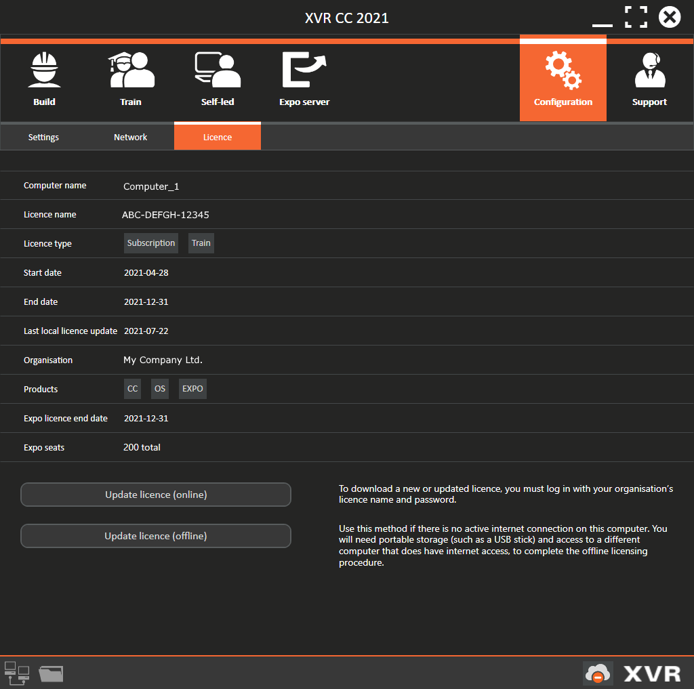
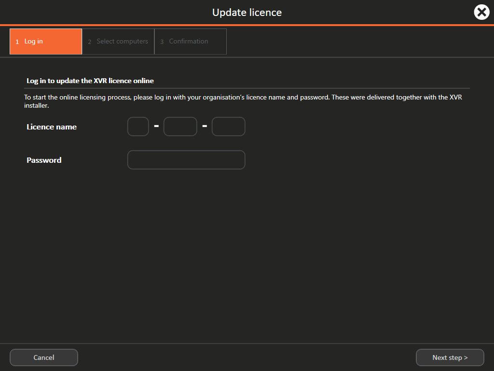
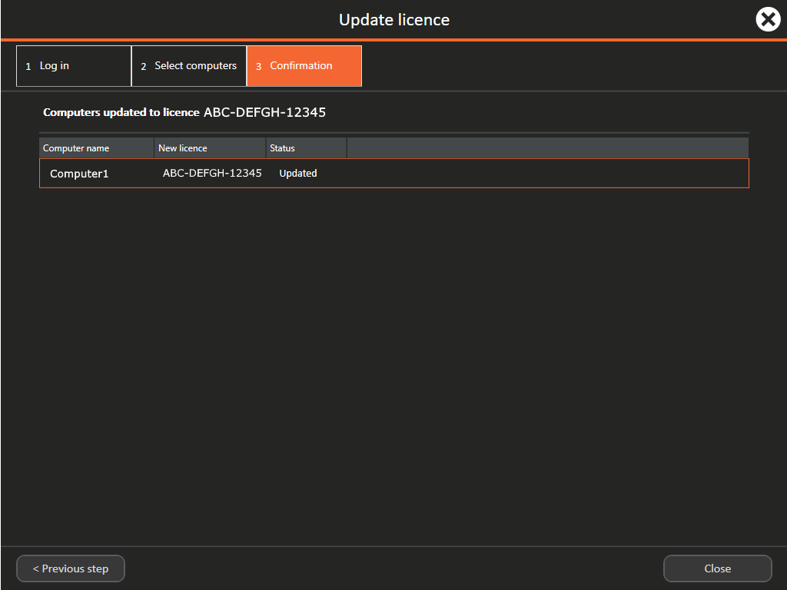
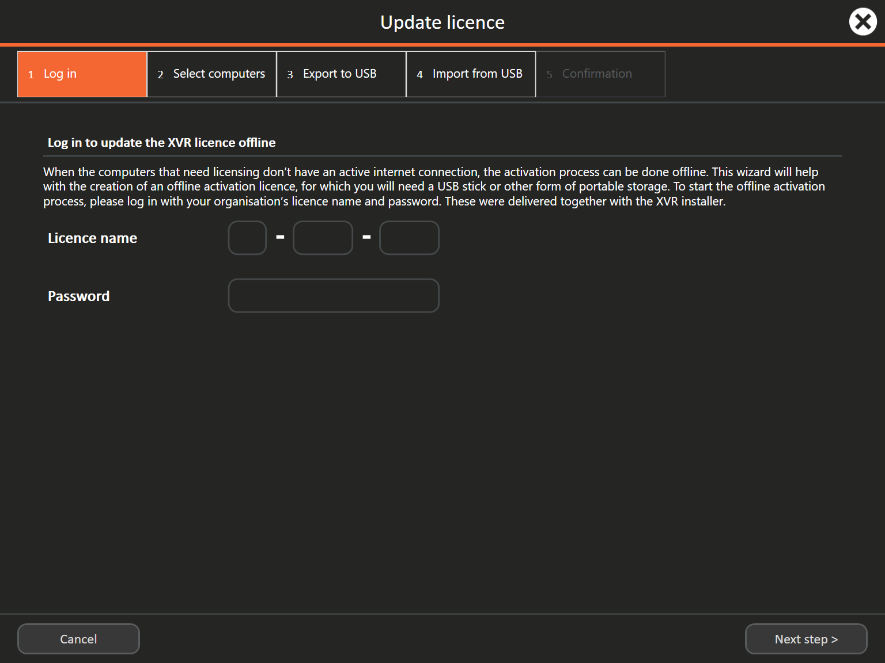
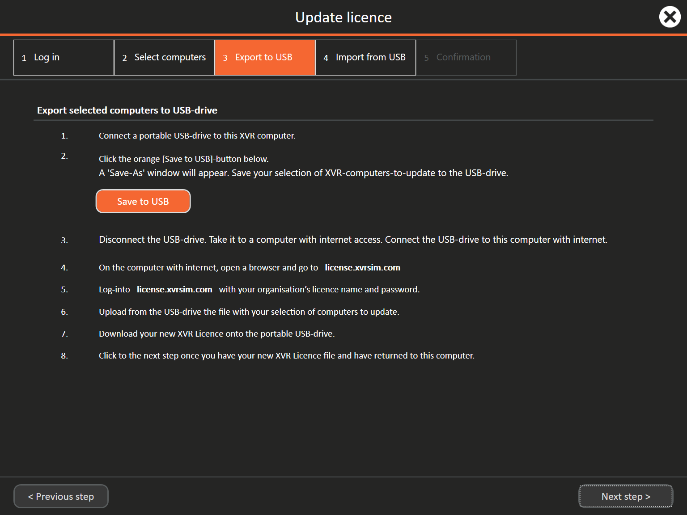
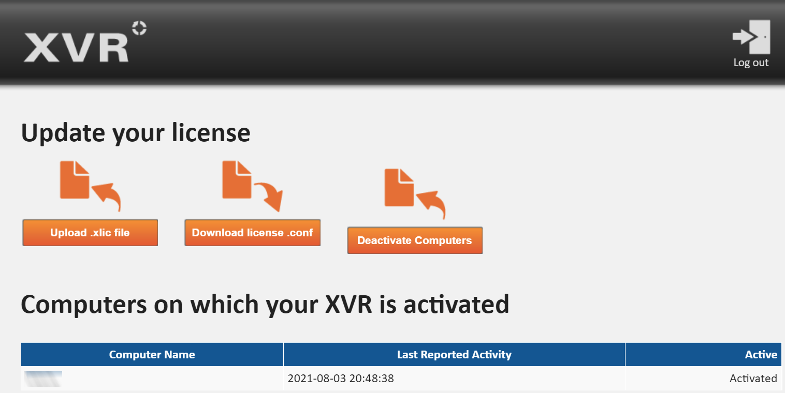
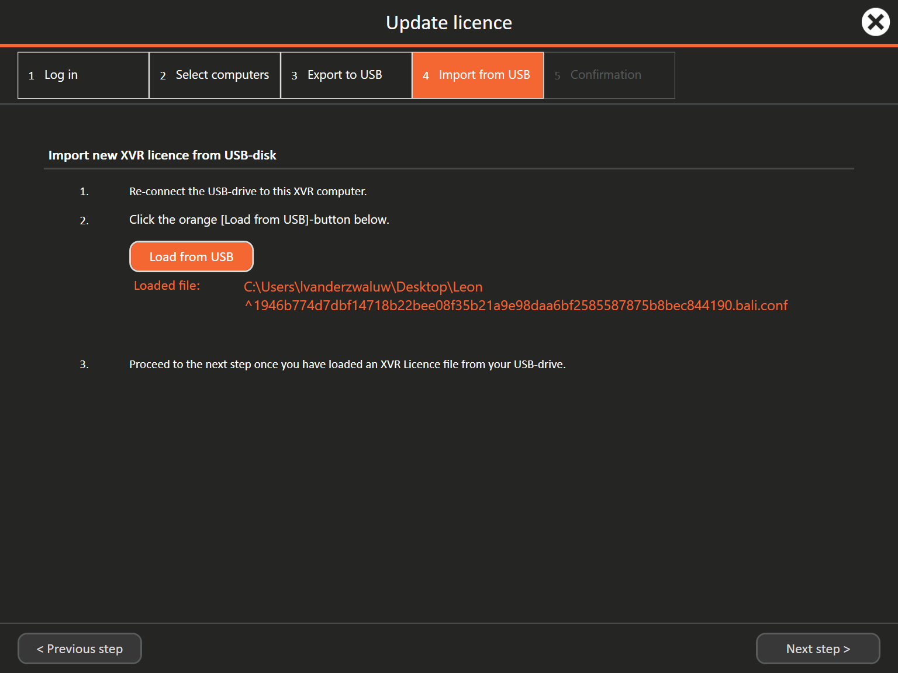

# 2 Activating the XVR Licence

You can only use XVR when a valid XVR Licence is activated. Activating a Licence is needed after you have newly installed XVR, when you have installed a newer version of XVR (software update), or when your previously activated Licence has expired. 

## 2.1 Introduction to XVR licences
An XVR Licence is acquired when your organisation has bought the XVR software or has been granted a trial for trying out XVR. It reflects the commercial agreement between your Organisation and XVR Simulation BV or one of its partners. A Licence determines:
* Who can use XVR (the Organisation)
* How long your Organisation can use XVR (start and end date)
* In what time intervals your Organisation is billed
* Which XVR software modules you can use (for example XVR OS or XVR Expo)
* What functionality of these XVR software modules is available (for example a Build versus a Train Licence)

### 2.1.1 The Licence sub-tab 
In XVR CC’s Configuration > Licence sub-tab, you can find information about the Licence present on the computer. You will see the licence name, the start and end dates, and the date when the Licence was last updated (see below). In case no Licence is activated on the computer, this information is left empty. 
In this tab, you also find buttons that allow you to activate or update your Licence.

## 2.2 License types
Licences are defined by their type and sub-type. The licence type governs which annual versions of the XVR software may be used, and when a Licence is valid. The available Licence types are:
#### Subscription Licence
A subscription Licence permits the use of the XVR software within the allotted subscription period for a specific set of computers. Once the end date is reached, XVR can no longer be used. XVR CC will start showing reminder pop-ups upon start-up when the Licence expiry date for a computer is near.The start and end date can be updated only by XVR Simulation BV on the licence server. For this you will need to do a local Licence update for the adjusted date(s) to show up on your computer.
With a Subscription Licence, you will receive upgrades and updates as long as your are subscribed.
#### Perpetual Licence 
A perpetual Licence is not bound by a specific timeframe. The Licence will never expire but is bound to specific version(s) of the XVR software, for a specific set of computers. Which  version(s) can be used is determined in the perpetual Licence. Though this Licence type is indefinitely valid, the XVR software still requires that computers with a perpetual Licence receive a Licence update once a year. This refresh date is indicated in the Licence sub-tab. If the refresh date is passed, the XVR software can no longer be used until a Licence update is done. XVR CC will start showing reminder pop-ups upon start-up when the Licence refresh date for a computer is near. With a perpetual license you will receive limited updates as stated in your licence
#### Pay-per-use Licence type
A pay-per-use Licence behaves much like a subscription Licence. It is tied to a specific set of computers and is usable between a specific start and end date. The only exception is that the use of a pay-per-use Licence is coupled with formal registration of the number of Sessions run with it. This is done for accurate billing purposes, but it does not meaningfully change the behaviour of the XVR software.
#### Trial Licence type
A trial Licence also acts similarly to a subscription Licence, with the exception that trial Licences are typically only made available for a relatively short duration and are intended for an organisation to try out the XVR software. Once a formal Licence agreement is signed, the Licence is converted into a subscription Licence, a perpetual Licence, or a pay-per-use Licence.

## 2.3 License subtypes
Besides the permissions governed by the Licence type, every Licence also has a sub-type. Licence sub-types determine how the Licenced XVR software may be used on the Licenced computers.
There are three available Licence types:
#### Train Licence sub-type
Licences of the "Train" sub-type are not actively constrained in terms of core functionalities.
This translates to the following permissions, where on the computer with a valid Licence, a user:
* Can create and test a Scenario (in Build mode)
* Can open/save Scenarios and Favourites (in Build mode)
* Is allowed Train mode start-up:
    * As a training participant
    * In  a dual start-up (1-on-1 training)
    * In a self-led start-up
    * Is allowed Review-mode start-up

A computer can either have a Build or a Train Licence activated.
#### Build Licence sub-type
Licences of the "Build" sub-type are only intended to perform Scenario building tasks, and are barred from starting Train or Review Sessions.
This translates to the following user permissions:
* Can create and test a Scenario (in Build mode)
* Can open/save Scenarios and Favourites (in Build mode)

Train- and Review-mode cannot be accessed if you have a Build Licence. A computer can either have a Build or a Train Licence activated, but not both. 
#### Expo Licence sub-type
The Expo Licence grants access to XVR Expo and the functionality and settings thereof in XVR OS and XVR CC. An Expo Licence can be added on top of a Train or Build Licence.
## 2.4 Activating your licence
It is advised to activate a Licence simultaneously on all your organisation’s XVR computers, with all these computers in the same network and all of them having internet access. This is referred to as the online licensing process. 
There is also a process of offline licensing, intended in case your XVR computers do not have access to internet.   
Both are described below.  

To start licensing XVR, make sure you have your Licence name and password close by. These are sent to your organisation by XVR Simulation BV or by one of its partners. If you do not have these credentials, contact the XVR Service desk or its partner. 

### 2.4.1 Activating your licence online
* Make sure all computers are connected to the same network and the computer that you use for the licensing can access the internet. If the computers can not connect to the same network, you will have to go through these steps for every single computer
* Open XVR CC on all the computers you wish to license, and check whether they can see each other in the network pop-up
* In XVR CC, on the computer with internet access, go to Configuration > Licence
* Click on Update licence (online)

Step 1 of the licensing wizard appears 

* Type in your Licence name and password and click Next step  
Step 2 of the licensing wizard appears, listing all computers in your network currently running XVR CC
* Select the computers that you want to license (advised is to license all your organisation’s computers at once and thus select all of them), and click Next step  
XVR CC will now contact the XVR licence server, send information of all selected computers, and receive a new Licence file and distribute this file to all selected computers
The wizard lists whether all selected computers have successfully received a new Licence and will show the state ‘Updated’ next to the computer name, as displayed below
* All selected computers are licensed. Click close to finish the process

### 2.4.2 Activating your licence offline
If the computers that you are trying to license do not have access to the internet, the following steps will allow you to license XVR on these specific computers. For this process, you require a USB disk and another computer that does have internet access (but does not have XVR installed). 

* Make sure all XVR computers are connected to the same network. If the computers can not connect to the same network, you will have to go through these steps for every single computer.
* Open XVR CC on all computers you wish to license, and check whether they can see each other in the network pop-up 
* In XVR CC, on one of these computers, go to Configuration > Licence 
* Click on Update licence (offline)  
Step 1 of the licensing wizard appears

* Type in your Licence name and password (sent to your organisation along with the delivery of the XVR software), and click Next step  
Step 2 of the licensing wizard appears, listing all computers in your network currently running XVR CC
* Select the computers that you want to license (advised is to license all your organisation’s computers at once and thus select all of them), and click Next step  
A pop-up appears asking you where to save the information of the selected computers 
* Insert a USB disk in the computer with XVR CC running, and save the file with information of the selected computers on it (filetype: .xlic). 

* Go with the USB disk to another computer with internet access and insert the USB disk into that computer
* Go to the website <a href="https://license.xvrsim.com/site/login" target="_blank">license.xvrsim.com</a> and login with your username (this is your Licence name including minus signs) and password (sent to your organisation along with the delivery of the XVR software).
A webpage similar to the figure below is shown

* Click on Upload .xlic file, select the file on the USB disk, and click Open
* Click on Download .conf file and save this Licence file on the USB disk
* Go with the USB disk back to the XVR computer and insert the USB disk in that computer
* In the offline licensing wizard, click on Next step 
* The next step of the offline licensing wizard is shown
* Click on Load from USB
* Select the .conf file on the USB disk, click Open and click on Next step
 

* XVR CC will now distribute the Licence file to all selected computers
* The wizard lists whether all selected computers have successfully received a new Licence and will show the state ‘Updated’ next to the computer name, as displayed below 
* All selected computers are licensed. Click close to finish the process

## 2.5 Activating your licence
When the type, content, maximum amount of computers, or end date of a Licence changes, due to new contractual agreements, this will be updated by XVR Simulation BV in the licensing system. This will not update automatically on the computers of your organisation with XVR installed. You will need to manually update the Licences.
You can update a Licence in the same way as you would activate or add a new one. 
By applying the licensing procedure to a computer that has already been licensed before, the old Licence is automatically replaced with a new one.

> [!IMPORTANT]>
>
>**Licensing more computers than permitted by the licence**  
>If you attempt to license more computers than your Licence permits, a warning message will appear.  
>Cancel the licensing procedure by closing the window.  
>Close XVR CC on the computers which you do not want to license, or deselect them in the wizard’s step 2  
>Re-start the licensing steps from the beginning.  
>It is possible that several computers in use in your organisation may already be licensed. These add up with the new computers to exceed the maximum defined in the Licence. If this is the case, and you wish to remove the Licence from some of the already licensed computers, contact the XVR Service desk.
