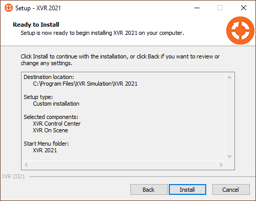
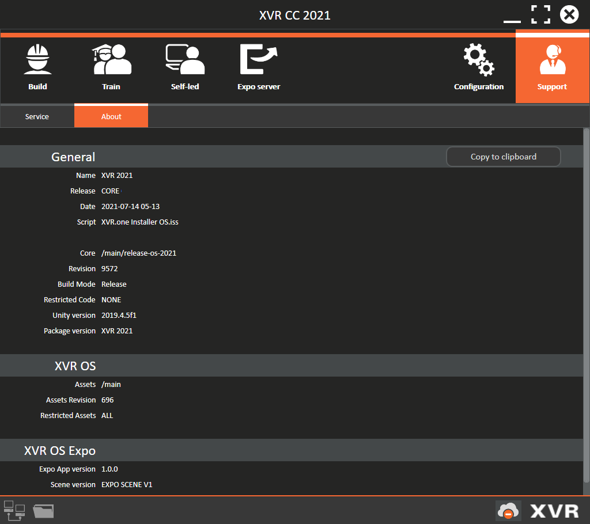
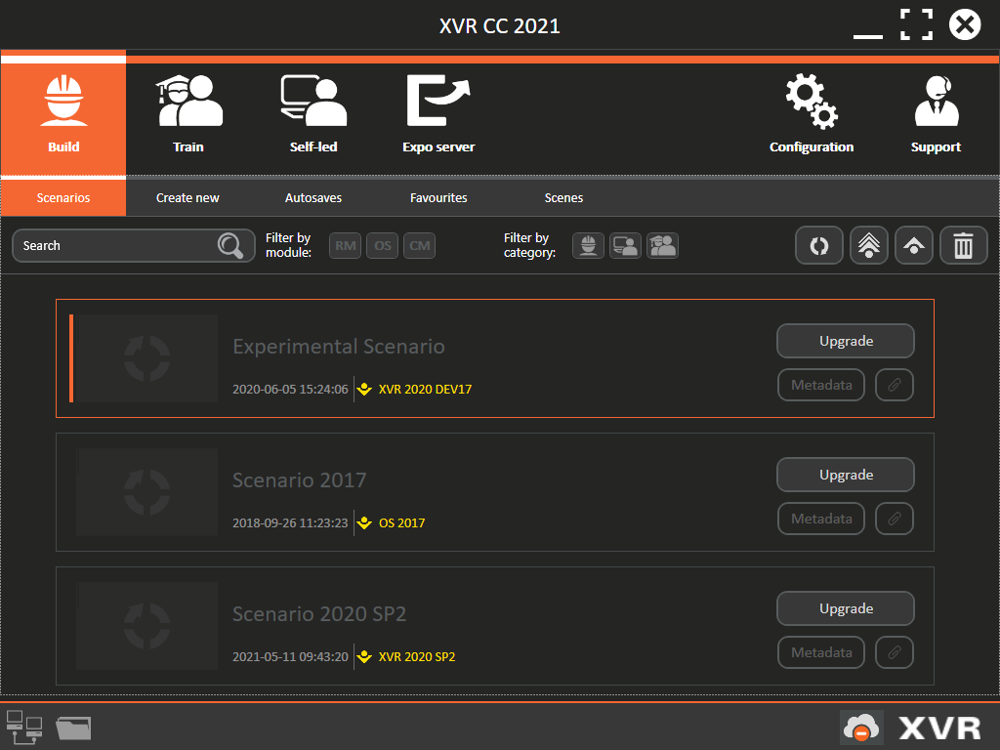

# 3. Installing XVR OS
## 3.1	Fresh installation

This section explains how to install XVR on a computer that has never had XVR installed on it before, and how to install XVR on a computer on which another version of XVR has been installed. 
If you are installing XVR on a computer that already has an (older) version of XVR installed, use the steps explained in the next section. 
#### Installing XVR on a new computer
* Download the latest XVR installer via the link provided in an e-mail sent by the XVR ServiceDesk, or navigate to the XVR installer on the USB disk sent to you. You can find this file in the folder with the name of the version, e.g. the 2022 version will be in a folder with a name starting with XVR 2022
* Double-click the XVR installer executable (filetype: .exe)
* The computer may ask you if you want to permit the installation. Answer Yes or Allow 
The installation will start and the first step of the installation wizard will be shown
* Select the language you wish to use when you first launch XVR; this can be changed later.
The installation wizard is shown full-screen with the XVR background. While this full-screen wizard is shown, the installation is ongoing.  
* Click on Next (clicking Cancel will terminate the installation) 
After reading the licence agreement and you agree with what you have read, select I accept the agreement and click Next .The installation wizard shows the location where XVR will be installed

XVR is by default installed in C:\Program Files\XVR Simulation, and a shortcut to XVR CC will be placed on your computer’s desktop. If you wish to use a different folder name or installation location, you can change this now. Then, click Next.

A summary of the location and name of the XVR software is shown. Once you have checked that everything is correct, click on Install (clicking Back will show the previous step of the installation wizard; clicking Cancel will terminate the installation)
 
 
 
The installation of XVR is now ongoing. The installation bar is gradually filled with a green bar, indicating the progress of the installation. This may take several minutes, depending on your computer. Please be patient. 

Once XVR is installed, the installation wizard asks whether you want to install a few supporting Microsoft programs. These Windows programs are required to ensure that XVR functions correctly:
* MS visual C++ 2010 Redistributable
* MS visual C++ 2010 Redistributable 64Bit (if your computer is running a 64Bits operating system)
* MS .NET Framework 4 Full Redistributable 

These programs are automatically selected to be installed. Unless you are sure that your computer already has these programs, do not unselect them. Click Next to continue and the selected programs are being installed
As long as the orange XVR background is shown, the installation is still ongoing.

When the orange XVR background disappears, the installation process is complete. You will find a shortcut to launch XVR CC on your computer’s desktop and you can find all installed XVR software modules in your Programs overview. 

## 3.2 Installing XVR OS on top of an older installation
This section describes how to install XVR on a computer that already has another version of XVR installed on it. It indicates the steps that differ from installing XVR on a computer with no XVR installed on it (see previous section)

#### Installing a newer or other version of XVR OS
Before running any process to (un)install XVR, it is required to have all software of XVR inactive by closing it down.  
> [!IMPORTANT]>
>
>It is advised to have only one version of XVR installed on your computer. This limits confusion for you and your colleagues about which version of XVR to use. Also, it is advised to have the newest release version of XVR installed, such that your organisation matches the version of XVR used by other users within the XVR Community and gives you the newest features and models.

> [!IMPORTANT]>
>
>Note that Scenarios opened in a newer version of XVR cannot be opened in an older version of XVR. And that Scenarios created in an older version first need to be upgraded before they can be opened in a newer version of XVR.  

#### Uninstalling an older version of XVR
If you want to do a clean install you can remove the (older) version first:
* Back up the contents of your XVR Storage folder first
* Open your MS Windows Settings menu, listing all programs installed on your computer
* Find in this list the version of XVR you want to uninstall
* Select this version of XVR and click Delete
* The uninstall wizard is shown, asking whether you want to uninstall XVR. Click Yes

The version of XVR is uninstalled. This may take a few minutes, depending on your computer. The shortcut on your computer’s desktop is deleted. 
Now follow the steps described in the previous section to install the newest version of XVR.

#### Installing XVR directly over/next to an older version of XVR
By following the steps described, you can also install XVR directly without first deleting the other already installed version of XVR. The following will happen:
If a version from the core is installed, the previously installed version of XVR is overwritten by the version of XVR being installed. In the first step of the installation process, you will be asked whether you want to uninstall the current version first. Click on Yes. 
For example, when XVR OS 10.1 is already installed and you are running the installation of XVR OS 10.2, this results in XVR being updated to the 10.2 version. All Scenarios and favourites have to be upgraded to be able to open them. 
> [!IMPORTANT]>
>
>As of 2025 we no longer use year versions. This means that releases are numbered 10.1, 10.2, 10.3 and so on. Previously it was possible to have different yearly versions installed, although you could only run one at a a time. With the numbered versions this is going to be 10 next to 11 and so on.  

## 3.3 Viewing details on installed XVR software
To ensure that all your computers are running the latest (or at least, the same) versions of XVR, the Support>About sub-tab, displayed below, can be used to see exactly which version of XVR is installed on your computer. This tab lists information such as the date of your installation, the name of the installer that was used, and the revision numbers for every individually installed XVR software module.

This tab also features a button that will copy the displayed information to your clipboard. This is useful if you need to quickly gather and send this information, for example when reporting information to the XVR Servicedesk.

## 3.4 After installing XVR
After successfully installing XVR, you are advised to pay attention to three things:
1. When you launch XVR CC for the first time, you will be prompted to activate your organisation’s XVR Licence. It is good practice to also update your license after installing a service pack to make sure you have all the latest objects and features
2. Check the version information, currently active Licence, network, and firewall settings of every computer with XVR installed. Make sure that all computers have the same version of XVR installed and the same Licence activated. All XVR software must be allowed to send and receive data through the firewall on every computer. After each update, the settings for the firewall might have to be readjusted.
3. If your computers have had an older version of XVR installed, upgrade the Scenarios and favourites on every computer.
 

## 3.5 Ugrading scenarios and favourites from previous versions
If you have created Scenarios in prior versions of XVR, you will need to upgrade them by following an automated process before you can use them in the XVR version you are currently using. The figure below shows an example of Scenarios that need upgrading, in which the Open button is replaced by an **Upgrade** button. This button will only be visible when the scenario is made in a previous version of the software.

Before a Scenario is upgraded to be used in the current version, a backup will be made for recovery purposes. These backups will be placed in …\XVR Storage\Backups. This ensures that you will always be able to recover older versions of your Scenarios after you have upgraded them, in case you wish to go back to an older version of XVR

#### Upgrading Scenarios 
* Make sure you have licensed XVR before you continue
* In XVR CC, go to Build > Scenarios
* All Scenarios in need of upgrading have an Upgrade button and the version name in which they were created marked in yellow
* Select the single Scenario you want to upgrade and click on Upgrade 
* Or select multiple Scenarios, by using the Ctrl button and click on Upgrade selected files
* Or to upgrade all outdated Scenarios, click on Upgrade all Scenarios. In all three cases, the upgrade wizard will start. Files that are newer, too old, or already matching, will be excluded from the selection
* Follow the steps of this wizard by selecting all Scenarios to upgrade (Step 1) and click Next step
* In case you have Scenarios made in special versions of XVR – for example a version specifically delivered to your organisation – these Scenarios are marked as ‘made in an experimental version’ and step 2 of the wizard appears. Read the information, check the “I have read the above text, and accept the risk of upgrading these XVR files to/from an experimental version.” and click Next step (clicking Previous step will take you back to step 1 of the wizard)
* The wizard shows a progress overview and all selected Scenarios are upgraded to the currently installed XVR version. Depending on the amount of Scenarios and your computer’s processing speed, this may take a few minutes. 
* When all Scenarios are upgraded, the final step of the wizard is shown, listing all successful and all unsuccessful upgraded Scenarios. Click on Close to end the upgrading process 
All successfully upgraded Scenarios are shown without a yellow-marked version name in the Scenarios sub-tabs. 
In case a problem occurs during the upgrading process, the last step of the wizard lists the upgrade issues and tips to resolve these problems. Try to resolve the problems as advised or contact the XVR ServiceDesk in case problems persist. There usually is a 2-year maximum version difference taken in account for successful Scenario upgrading. 

#### Recovering (downgrading) previously upgraded Scenarios
Once a Scenario has been upgraded to a newer version of XVR, it can never be opened by older versions. When switching back to an older version of XVR again, you will find yourself wanting to recover the Scenarios you upgraded. XVR CC allows you to do so, assuming the backup created during the upgrade is still present on your computer.

##### Method 1
First, install the older version of XVR (similar to installing a newer version, as explained before). It is essential that the older version uses the same XVR Storage location as the newer versions, or that all Scenarios and backups match. 

Recovery can only be done for one Scenario at a time. Instead of an ‘Open’ button, newer Scenarios will show a ‘Recover’. When you click **Recover**, you are offered three possible recovery options:
1. Matching file in backup folder: If a Scenario with the same name (and compatible with the present version) can be found in the backup folder, you will be shown a button that will take you directly to this Scenario.
2. Backup folder for the current version: If no matching Scenario name can be found in …\XVR Storage\Backups, but there are backups available for the version of XVR you are currently using, you will be shown a button that will open said folder. If the original Scenario exists under a different name, you should be able to find it here.
3. Backup folder: If no backups are available for the version you are currently using, you can still use the button offered here to go directly to the root of your backup folder. As a last resort, you could try exploring backup folders of versions older than the one you are currently using.

If you have found a backed-up Scenario that you want to restore to your current …\XVR Storage\Scenarios, you need to manually copy it back into …\XVR Storage\Scenarios. When you refresh the Scenarios sub-tab in XVR CC, the recovered Scenario will show up and you will be able to continue working with it. 

##### Method 2

Another way to make the older scenarios available is:
* Make a copy of the scenario and the favourite folder from the right version in the back-up directory
* Uninstall the newer version
* Install the older version
* Re-license this older version
* Move the content of the copies that you made earlier to the scenario and favourite folders in the standard locations

